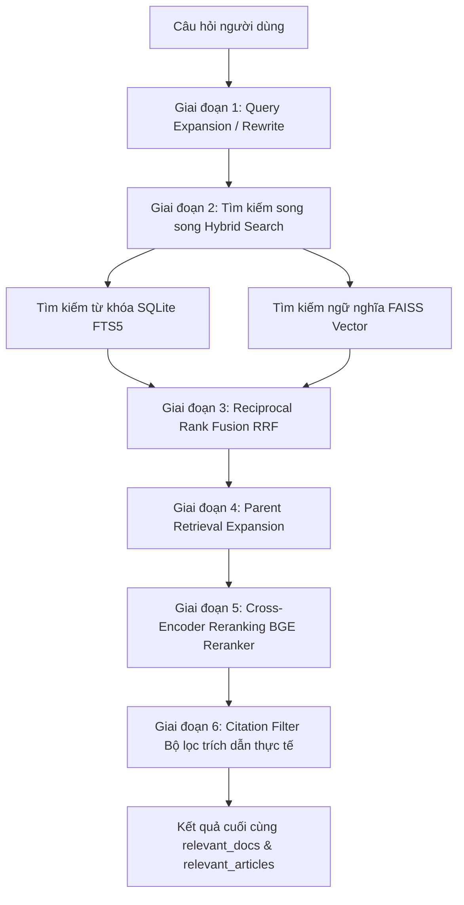

# R2AI — Legal RAG Assistant (Vietnamese)

Hệ thống RAG (Retrieval-Augmented Generation) dành cho văn bản pháp lý tiếng Việt, phục vụ cuộc thi **R2AI 2026**.  
Sử dụng **SQLite + FTS5** (offline) kết hợp **Supabase PostgreSQL + pgvector** (online) để tra cứu văn bản pháp luật theo hybrid search (BM25 + vector).

---

## 📁 Cấu trúc thư mục

```
R2AI/
│
├── .env                          # Biến môi trường (Supabase URL, DB URL, keys)
│
├── config/
│   └── config.py                 # Đọc .env, cung cấp class Config cho toàn project
│
├── src/                          # Xử lý dữ liệu thô → chunks
│   ├── legal_chunker.py          # Module chunking văn bản pháp lý (core logic)
│   ├── process_chunks.py         # Script chính: lọc, chunk, lưu vào local SQLite
│   └── test_chunking.py          # Kiểm tra chất lượng chunking trên ~5 docs mẫu
│
├── database/                     # Tạo embeddings + đồng bộ lên Supabase
│   ├── schema.sql                # Schema Supabase (documents + document_chunks)
│   ├── generate_local_embeddings_mp.py   # Sinh embeddings bằng CPU (multiprocessing)
│   └── push_chunks_to_supabase.py        # Upload chunks + embeddings lên Supabase
│
├── retrieval/                    # Pipeline truy vấn
│   ├── local_retriever.py        # Retriever offline dùng SQLite + FTS5 + vector
│   ├── retriever.py              # Retriever online dùng Supabase PostgreSQL
│   ├── batch_retrieve.py         # Truy vấn hàng loạt câu hỏi từ file JSON
│   ├── setup_fts5.py             # Tạo FTS5 virtual table trong SQLite
│   └── test_retrieval.py         # CLI tương tác test retrieval (không cần LLM)
│
├── logs/                         # Output, báo cáo sinh ra khi chạy scripts
├── data/                         # Dữ liệu thô (data/raw) và đã xử lý (data/processed)
└── vietnamese-legal-documents/   # Dataset gốc (parquet) — không commit lên git
    ├── metadata/                 # Metadata các văn bản pháp lý
    └── content/                  # Nội dung full-text các văn bản
```

---

## ⚙️ Cài đặt môi trường

### 1. Tạo và kích hoạt môi trường ảo (.venv)

Nên đặt tên thư mục môi trường ảo là `.venv` (tránh đặt tên trùng với file `.env` cấu hình để không bị ghi đè/nhầm lẫn).

* **Bước A: Tạo môi trường ảo**
  ```bash
  python -m venv .venv
  ```

* **Bước B: Kích hoạt môi trường ảo**
  * **Dành cho Command Prompt (CMD):**
    ```cmd
    .venv\Scripts\activate.bat
    ```
  * **Dành cho PowerShell:**
    ```powershell
    .venv\Scripts\Activate.ps1
    ```
    *Lưu ý:* Nếu gặp lỗi bảo mật (Execution Policy) trên PowerShell, chạy lệnh sau trước khi kích hoạt:
    ```powershell
    Set-ExecutionPolicy -ExecutionPolicy RemoteSigned -Scope Process
    ```

### 2. Cài đặt các thư viện (Python packages)

Sau khi đã kích hoạt môi trường ảo (bạn sẽ thấy `(.venv)` xuất hiện ở đầu dòng lệnh), tiến hành cài đặt các package:
Hệ thống RAG (Retrieval-Augmented Generation) chuyên sâu dành cho văn bản pháp lý tiếng Việt. Hệ thống được thiết kế để chống lại các lỗi rủi ro của AI (hallucination) nhờ cơ chế kiểm duyệt chặt chẽ, kết hợp tìm kiếm đa mô thức (Hybrid Search: BM25 + Vector) và chấm điểm lại (Reranking).

---

## ⚙️ Hướng dẫn cài đặt môi trường

### 1. Cài đặt Python packages
Yêu cầu Python 3.8 trở lên. Cài đặt các thư viện cần thiết bằng lệnh:

```bash
pip install -r requirements.txt
```
*(Hoặc cài thủ công: `pip install sentence-transformers pandas pyarrow psycopg2-binary python-dotenv numpy pyvi faiss-cpu torch transformers accelerate`)*

### 3. Cấu hình `.env`

Tạo file `.env` tại root (đã có sẵn, chỉ cần cập nhật nếu đổi project Supabase):
### 2. Cấu hình biến môi trường (`.env`)
Tạo file `.env` tại thư mục gốc (nếu dùng cơ sở dữ liệu Supabase online). Nếu chỉ chạy local SQLite thì không bắt buộc, nhưng khuyến nghị:

```env
SUPABASE_URL=https://<project>.supabase.co
SUPABASE_ANON_KEY=<anon_key>
SUPABASE_SERVICE_ROLE_KEY=<service_role_key>
DATABASE_URL=postgresql://postgres.<project>:<password>@<host>:5432/postgres
```

---

## 🚀 Hướng dẫn tiền xử lý dữ liệu (Data Pipeline)

Trước khi hệ thống có thể trả lời câu hỏi, bạn cần xử lý dữ liệu thô và xây dựng Database tìm kiếm:

**Bước 1: Lọc, Chunking và lưu vào SQLite cục bộ**
Chạy lệnh dưới đây để cắt văn bản pháp lý thành các đoạn nhỏ (chunk) theo từng Điều khoản:
```bash
python src/process_chunks.py
```
*(Kết quả tạo ra `database/local_chunks.db` chứa dữ liệu văn bản)*

**Bước 2: Thiết lập Full-Text Search (FTS5)**
Tạo bảng tìm kiếm từ khóa ảo (Virtual Table) bên trong SQLite:
```bash
python retrieval/setup_fts5.py
```

**Bước 3: Sinh Vector Embeddings**
Mã hóa văn bản thành Vector ngữ nghĩa (có thể mất nhiều giờ nếu chạy CPU):
```bash
python database/generate_local_embeddings_mp.py
```

---

## 🧠 Hướng dẫn Chạy & Kiểm thử Hệ thống (RAG Pipeline)

### 1. Kiểm thử tìm kiếm cơ bản (Chưa dùng LLM)
Sử dụng CLI tương tác để kiểm tra xem hệ thống có tìm đúng tài liệu hay không (Offline mode):

```bash
python retrieval/test_retrieval.py --local --mode hybrid --query "Điều kiện thành lập doanh nghiệp" --top-k 5
```
Các tham số:
- `--mode`: Chọn `fts` (Từ khóa), `vector` (Ngữ nghĩa) hoặc `hybrid` (Kết hợp cả hai).
- `--benchmark`: Thêm flag này để đánh giá tốc độ giữa các phương pháp.

### 2. Kiểm thử luồng End-to-End (RAG: Tìm kiếm + AI sinh câu trả lời)
Chạy script test cục bộ với 5 câu hỏi mẫu. Hệ thống sẽ kết hợp Hybrid Search, Reranking, Validation và LLM (VD: Qwen) để đưa ra câu trả lời:

```bash
python test_run.py
```
*Lưu ý: Bạn có thể sửa `test_run.py` để đổi model LLM (Ví dụ: `Qwen/Qwen1.5-4B-Chat` hoặc `Qwen/Qwen2.5-0.5B-Instruct`). Lần đầu chạy sẽ cần tải model từ HuggingFace.*

### 3. Chạy hàng loạt để lấy kết quả (Batch Retrieval)
Để tạo file `results.json` nộp bài hoặc đánh giá toàn diện trên tệp câu hỏi lớn:

```bash
python src/retrieval/batch_retrieve.py \
    --input test_questions.json \
    --output test_results.json \
    --mode hybrid \
    --top-k 5 \
    --rerank \
    --llm \
    --llm-model "Qwen/Qwen1.5-4B-Chat"
```
## 🔍 Chi Tiết Pipeline Retrieval (Tìm Kiếm & Truy Xuất)

Pipeline tìm kiếm và truy xuất (retrieval) của R2AI được tối ưu hóa sâu sắc cho văn bản pháp lý Việt Nam, bao gồm 6 bước xử lý tuần tự để đảm bảo độ bao phủ (Recall) và độ chính xác (Precision) cao nhất:



### 1. Giai đoạn 1: Query Expansion & Rewrite
- Sử dụng mô hình LLM để tự động viết lại câu hỏi gốc thành một truy vấn tìm kiếm tối ưu hơn.
- Truy vấn mới sẽ bổ sung các thuật ngữ pháp lý đồng nghĩa, các từ khóa bổ trợ.
- Chuỗi tìm kiếm cuối cùng là sự kết hợp của: `[Câu truy vấn đã viết lại] [Câu truy vấn gốc]`.

### 2. Giai đoạn 2: Tìm kiếm song song (Hybrid Search)
Hệ thống truy vấn đồng thời trên hai kênh độc lập để tận dụng tối đa thế mạnh của từng phương pháp:
- **Tìm kiếm từ khóa (SQLite FTS5)**: 
  - Tokenize câu hỏi và xây dựng biểu thức logic Boolean (`AND` / `OR`) tự động.
  - Tìm kiếm chính xác các thuật ngữ chuyên ngành, số hiệu điều luật trên bảng ảo FTS5 của SQLite.
- **Tìm kiếm ngữ nghĩa (FAISS Vector)**:
  - Sử dụng mô hình `bkai-foundation-models/vietnamese-bi-encoder` để chuyển đổi câu hỏi thành Vector Embedding 768 chiều.
  - Thực hiện tìm kiếm lân cận gần nhất trên chỉ mục FAISS (`local_chunks.index`) để bắt được các câu diễn đạt gián tiếp hoặc đồng nghĩa.

### 3. Giai đoạn 3: Trộn kết quả (Reciprocal Rank Fusion - RRF)
- Kết quả từ SQLite FTS5 và FAISS Vector được kết hợp bằng thuật toán RRF với tham số mặc định $k=60$.
- Áp dụng trọng số tối ưu đặc thù cho văn bản pháp luật: `fts_weight = 0.7` và `vector_weight = 0.3` (từ khóa chính xác đóng vai trò then chốt).

### 4. Giai đoạn 4: Parent Retrieval Expansion (Mở rộng ngữ cảnh)
- Các chunk được chọn từ RRF sẽ được đối chiếu với cơ sở dữ liệu SQLite để lấy thêm các chunk liền kề (trước và sau) thuộc cùng một Điều luật/Văn bản.
- Việc này giúp mở rộng ngữ cảnh đầy đủ, tránh việc mất thông tin do các câu bị cắt nửa chừng trong quá trình chunking.

### 5. Giai đoạn 5: Chấm điểm lại (Cross-Encoder Reranking)
- Chuyển Top-K ứng viên qua mô hình Reranker cực mạnh `BAAI/bge-reranker-v2-m3` để so khớp trực tiếp cặp `(câu hỏi, văn bản)`.
- **Metadata Boosting**: Nội dung đưa vào Reranker được cấu trúc hóa rõ ràng để mô hình hiểu được cấu trúc phân cấp pháp lý:
  ```text
  Văn bản: {legal_type} {doc_number} - {title}
  Điều: {article_hint}
  Nội dung:
  {nội dung chunk}
  ```
- **Sigmoid Score Normalization**: Áp dụng hàm Sigmoid toàn cục để chuẩn hóa điểm số logit thô về khoảng `[0.0, 1.0]`.
- **Trọng số loại văn bản (Legal Weight)**: Nhân điểm số với hệ số ưu tiên dựa trên loại văn bản để đưa các nguồn luật gốc lên đầu (Ví dụ: `Luật / Bộ luật`: 1.0, `Nghị quyết`: 0.95, `Nghị định`: 0.85, `Thông tư`: 0.75).
- **Lọc ngưỡng tối thiểu (Rerank Threshold)**: Loại bỏ các tài liệu có điểm số thấp hơn `0.35` để giảm nhiễu.
- **MMR Diversity Filter**: Giới hạn tối đa 2 chunk cho mỗi tài liệu để đảm bảo sự đa dạng và tiết kiệm token cho LLM.

### 6. Giai đoạn 6: Citation Filter (Bộ lọc trích dẫn sau sinh)
- Để tối đa hóa **độ chính xác (Precision)** trên file nộp bài (tránh trường hợp trả về nhiều tài liệu nhưng LLM không sử dụng):
  - Phân tích câu trả lời được sinh ra bởi LLM bằng Regex để tìm ra các số hiệu văn bản (Ví dụ: `125/2020`) và số Điều (Ví dụ: `Điều 14`).
  - Chỉ giữ lại trong thuộc tính `relevant_docs` và `relevant_articles` các tài liệu thực tế được LLM trích dẫn làm căn cứ.
  - **Cơ chế Fallback an toàn**: Nếu LLM không trích dẫn gì hoặc trích dẫn sai định dạng, hệ thống tự động giữ lại tài liệu và điều luật ở Top-1 của bộ Reranker để đảm bảo độ bao phủ cơ sở (Base Recall).

---

## 🛡 Kiến trúc & Cơ chế phòng vệ của Pipeline

Dự án R2AI sử dụng **RAG Pipeline 3 Giai Đoạn** để đảm bảo tính pháp lý tuyệt đối:

1. **Retrieval & Reranking**: Kết hợp FTS5 và Vector (`bkai-bi-encoder`), sau đó dùng Reranker (`bge-reranker-v2-m3`) để đưa các điều luật liên quan nhất lên đầu.
2. **Validator (Rào chắn ảo giác)**: Bất kỳ câu trả lời nào của AI sinh ra đều được quét Regex. Nếu AI tự bịa ra "Điều luật" không tồn tại trong tài liệu cung cấp, hệ thống lập tức chặn lại.
3. **Safe Generation**: 
   - LLM bị giới hạn bởi Prompt cực kỳ khắt khe (Cấm dùng Placeholder, cấm lặp lại nội dung).
   - Nếu bị Validator chặn, LLM sẽ tự động **Retry** (nhận cảnh báo và sửa lỗi).
   - Nếu LLM vẫn vi phạm, hệ thống tự động **Fallback** sang tạo câu trả lời tĩnh (Rule-based) từ văn bản gốc, đảm bảo không bao giờ cung cấp thông tin sai lệch cho người dùng.

*(Xem chi tiết phân tích luồng tại file `PIPELINE.md`)*
