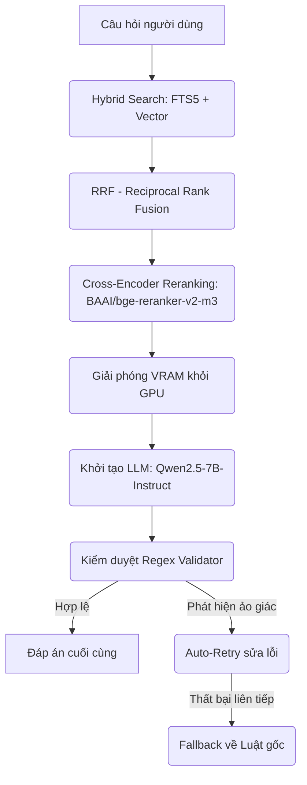
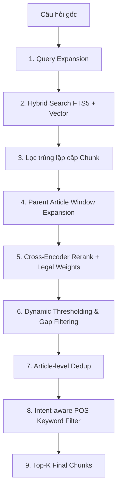

# R2AI — Vietnamese Legal RAG Assistant

Hệ thống RAG (Retrieval-Augmented Generation) chuyên sâu dành cho văn bản pháp lý tiếng Việt. Hệ thống được thiết kế tối ưu hiệu năng chạy trên môi trường **Kaggle (GPU T4 x 2)** và **Local Offline**, chống ảo giác (hallucination) nhờ cơ chế kiểm duyệt chặt chẽ, kết hợp tìm kiếm đa mô thức (Hybrid Search: BM25 + Vector) và chấm điểm lại (Reranking).

---

## 🏛️ Kiến trúc RAG Pipeline 3 Giai Đoạn



1. **Giai đoạn 1: Retrieval & Reranking**
   * Sử dụng SQLite cục bộ làm DB.
   * Chạy song song FTS5 (từ khóa) và Vector Search (`bkai-bi-encoder`).
   * Reranking bằng mô hình `BAAI/bge-reranker-v2-m3` để chọn ra Top-K điều luật chuẩn xác nhất.
2. **Giai đoạn giải phóng VRAM (GPU Memory Cleanup)**
   * Giải phóng hoàn toàn các mô hình Embedding và Reranker để GPU trống 100% trước khi nạp LLM.
3. **Giai đoạn 2: Generation & Validation**
   * Load LLM `Qwen2.5-7B-Instruct` qua `device_map="auto"` (chia model lên cả 2 GPU T4).
   * Kiểm duyệt chặt chẽ bằng regex (`validator.py`). Nếu phát hiện AI bịa điều luật, hệ thống kích hoạt **Auto-Retry** (tối đa 2 lần).
   * Nếu vẫn lỗi, hệ thống tự động **Fallback** lấy văn bản luật gốc làm đáp án để tránh ảo giác.

---

## 🚀 Quy trình thực thi trên Kaggle (GPU T4 x 2)

Để chạy trơn tru 2000 câu hỏi trên Kaggle không lo bị tràn VRAM hay bị treo tiến trình (deadlock), hãy làm theo 2 bước tương ứng với 2 block trong Notebook:

### 📥 Bước 1: Thiết lập môi trường & Patch đa GPU (Block 1)
Dán và chạy đoạn code sau trong cell Setup. Cell này sẽ:
* Hạ cấp thư viện `transformers` và `tokenizers` để sửa lỗi `prepare_for_model`.
* Liên kết (symlink) database và file câu hỏi.
* Tạo file patch `/kaggle/working/sitecustomize.py` cấu hình Reranker chạy trên `cuda:0` nhằm chống lỗi treo deadlock của PyTorch trên môi trường T4 x 2.

```python
import os, sys, shutil, subprocess

# 1. Cài đặt thư viện tương thích (Tránh lỗi 'prepare_for_model' trên Kaggle)
print("📦 Đang cấu hình phiên bản thư viện tương thích...")
try:
    subprocess.run(
        [sys.executable, "-m", "pip", "install", "-q", "--no-warn-script-location", "transformers==4.44.2", "tokenizers==0.19.1"],
        check=True
    )
    print("✅ Cài đặt thư viện thành công.")
except Exception as e:
    print(f"⚠️ Cảnh báo lỗi khi cài đặt thư viện: {e}")

WORKING   = "/kaggle/working"
INPUT_BASE = "/kaggle/input"

# 2. Tìm kiếm datasets tự động
# Tìm kiếm thư mục code và database (đã unzip) từ Kaggle input
code_dir = None
data_dir = None
for item in os.listdir(INPUT_BASE):
    path = os.path.join(INPUT_BASE, item)
    if not os.path.isdir(path):
        continue
    if any(k in item.lower() for k in ["code", "r2aiii"]):
        code_dir = path
    elif any(k in item.lower() for k in ["data", "database"]):
        data_dir = path

# Tạo liên kết database sang /kaggle/working
db_dst = os.path.join(WORKING, "database")
if data_dir and os.path.exists(data_dir):
    if os.path.islink(db_dst) or os.path.exists(db_dst):
        os.remove(db_dst)
    os.symlink(os.path.join(data_dir, "database"), db_dst)
    print(f"🔗 Symlink Database: {data_dir} -> {db_dst}")

# 3. Tạo file Patch chống deadlock đa GPU (Sitecustomize)
with open("/kaggle/working/sitecustomize.py", "w", encoding="utf-8") as f:
    f.write('''
import os
import builtins
orig_import = builtins.__import__

def custom_import(name, globals=None, locals=None, fromlist=(), level=0):
    module = orig_import(name, globals, locals, fromlist, level)
    if name == "sentence_transformers":
        try:
            import torch
            from FlagEmbedding import FlagReranker
            class FlagRerankerCrossEncoderPatch:
                def __init__(self, model_path, device=None, automodel_args=None):
                    if not os.path.exists(model_path):
                        model_path = "BAAI/bge-reranker-v2-m3"
                    use_fp16 = (device == "cuda" or device == "cuda:0")
                    dev = "cuda:0" if torch.cuda.is_available() else "cpu"
                    print(f"[Kaggle Patch] Khởi tạo FlagReranker: {model_path} (use_fp16={use_fp16}, devices={dev})")
                    self.reranker = FlagReranker(model_path, use_fp16=use_fp16, devices=dev)
                def predict(self, pairs, show_progress_bar=False):
                    return self.reranker.compute_score(pairs)
            module.CrossEncoder = FlagRerankerCrossEncoderPatch
            print("[Kaggle Patch] Đã ghi đè CrossEncoder thành FlagReranker thành công!")
        except Exception as e:
            print(f"[Kaggle Patch] Lỗi khi apply patch: {e}")
    return module

builtins.__import__ = custom_import
''')
print("✅ Hoàn tất thiết lập Block 1!")
```

### 🏃‍♂️ Bước 2: Chạy thực thi Pipeline (Block 2)
Chạy cell này trực tiếp bằng lệnh terminal (`!`) để xem log thời gian thực (real-time unbuffered logging) không sợ bị trễ log:

```bash
!PYTHONPATH=/kaggle/working python -u /kaggle/working/code/src/retrieval/batch_retrieve.py \
    --input /kaggle/working/database/R2AIStage1DATA.json \
    --output /kaggle/working/results.json \
    --mode hybrid \
    --top-k 10 \
    --rerank \
    --llm \
    --llm-model Qwen/Qwen2.5-7B-Instruct
```

*Lưu ý:* Hệ thống tích hợp sẵn cơ chế checkpoint. Nếu phiên chạy bị ngắt quãng do hết thời gian (timeout) hoặc kernel tự động reset, bạn chỉ cần bấm chạy lại Block 2, hệ thống sẽ tự động resume từ câu hỏi gần nhất mà không phải làm lại từ đầu.

---

## 💻 Hướng dẫn chạy trên môi trường Local (Máy cá nhân)

### 1. Cài đặt thư viện
```bash
pip install -r requirements.txt
```

### 2. Tiền xử lý dữ liệu
Nếu bạn xây dựng database cục bộ từ đầu:
1. **Phân đoạn văn bản**: `python src/process_chunks.py` (tạo `database/local_chunks.db`).
2. **Cấu hình FTS5**: `python retrieval/setup_fts5.py` (tạo bảng ảo tìm kiếm từ khóa).
3. **Tạo Vector**: `python database/generate_local_embeddings_mp.py` (mã hóa vector FAISS).

### 3. Kiểm thử nhanh
Chạy file test 5 câu hỏi cục bộ:
```bash
python test_run.py
```

---

## 🔍 Chi Tiết Pipeline của Retriever (Truy xuất nâng cao)

Để đạt độ chính xác cao nhất đối với các câu hỏi pháp luật, class `LegalRetriever` (`src/retrieval/retriever.py`) triển khai một pipeline truy xuất 9 bước nghiêm ngặt:



1. **Giai đoạn 1: Query Expansion (Intent Understanding)**
   * Phân tích và mở rộng từ khóa trong câu hỏi của người dùng nhằm tối ưu hóa khả năng khớp từ khóa FTS5 và tìm kiếm ngữ nghĩa.

2. **Giai đoạn 2: Candidate Retrieval (BM25 + Semantic)**
   * Thực hiện tìm kiếm song song:
     * **FTS5 (BM25)**: SQLite virtual table cho kết quả nhanh và chính xác theo từ khóa pháp lý.
     * **Vector Search**: Sử dụng mô hình `bkai-bi-encoder` để lấy embedding và so khớp độ tương đồng FAISS.
   * Kết hợp kết quả của 2 luồng qua thuật toán **RRF (Reciprocal Rank Fusion)** với trọng số tùy chỉnh (mặc định: FTS 0.7 / Vector 0.3) tạo ra danh sách ứng viên (candidate pool) gồm 50 chunks.

3. **Giai đoạn 3: Chunk-level De-duplication**
   * Lọc bỏ những chunk trùng lặp hoặc gần như trùng lặp hoàn toàn về ký tự (sau khi đã normalize text) để tránh dư thừa thông tin.

4. **Giai đoạn 4: Parent Article Window Expansion (Mở rộng ngữ cảnh)**
   * Dựa vào `article_hint` (ví dụ: *Điều 15*), hệ thống tự động tìm và gộp các chunk liền kề (trong khoảng window `+/- 2` chunk của kết quả hit) để tạo nên nội dung Điều luật đầy đủ, mạch lạc.
   * Đồng thời lưu trữ `best_chunk_content` (chunk có điểm số cao nhất ban đầu) để làm đầu vào so khớp cho bước Rerank sau đó.

5. **Giai đoạn 5: Cross-Encoder Reranking & Boosting**
   * Sử dụng `bge-reranker-v2-m3` để so khớp trực tiếp giữa cặp `[Câu hỏi, Chunk]`.
   * Áp dụng trọng số ưu tiên **Legal Authority Boosting** để nhân điểm số dựa trên cấp bậc pháp lý của văn bản:
     * `Luật / Bộ luật`: nhân hệ số `1.0`
     * `Nghị quyết`: nhân hệ số `0.95`
     * `Nghị định`: nhân hệ số `0.85`
     * `Thông tư`: nhân hệ số `0.75`

6. **Giai đoạn 6: Dynamic Thresholding & Gap Filtering**
   * Loại bỏ các tài liệu có điểm Rerank thấp hơn ngưỡng tuyệt đối `0.40`.
   * Lọc động theo tỷ lệ điểm so với ứng viên cao nhất (Relative Threshold `65%`).
   * **Dynamic Gap Filtering**: Nếu ứng viên Top 1 có điểm số vượt trội hoàn toàn so với Top 2 (chênh lệch `> 0.25`), tỷ lệ lọc tương đối sẽ tự động tăng lên `85%` để loại bỏ toàn bộ các chunk nhiễu phía dưới.

7. **Giai đoạn 7: Article-level De-duplication**
   * Đảm bảo cấu trúc ngữ cảnh gọn gàng bằng cách chỉ giữ lại tối đa 1 phiên bản duy nhất cho mỗi đơn vị Điều luật (`document_id` + `article_hint`).

8. **Giai đoạn 8: Intent-aware POS Keyword Filter**
   * Sử dụng thư viện `underthesea` để tách nhãn từ loại (POS Tagging) của câu hỏi gốc, lọc ra các danh từ, danh từ riêng, động từ và tính từ cốt lõi.
   * Kiểm tra xem nội dung của Điều luật được truy xuất có chứa ít nhất một trong các từ khóa cốt lõi này không. Nếu không, hệ thống sẽ loại bỏ Điều luật đó để tránh bị lệch chủ đề. (Nếu lọc hết, hệ thống sẽ tự động bypass và lấy kết quả trước đó).

9. **Giai đoạn 9: Top-K Output**
   * Trích xuất Top-K (mặc định: 10) tài liệu chuẩn xác nhất để đưa vào prompt cho LLM sinh đáp án.

